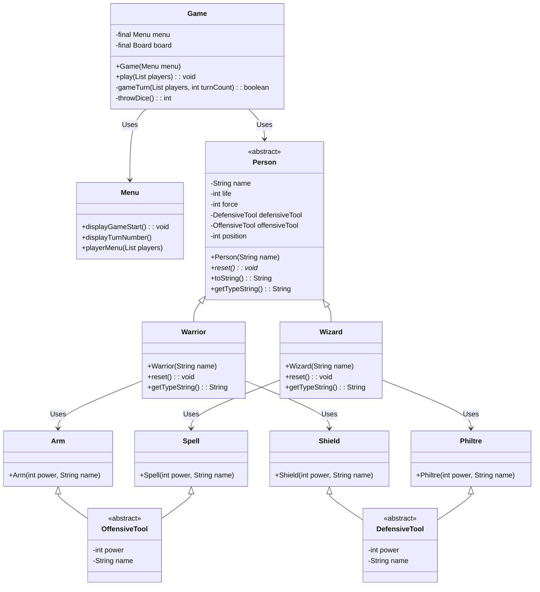

```mermaid

classDiagram
 
 
    class Menu {
        +displayGameStart() : void
        +displayTurnNumber()
        +playerMenu(List<Person> players)
    }

    class Game {
        -final Menu menu
        -final Board board
        +Game(Menu menu)
        +play(List<Person> players) : void
        -gameTurn(List<Person> players, int turnCount) : boolean
        -throwDice() : int
    }

    class Person {
        <<abstract>>
        -String name
        -int life
        -int force
        -DefensiveTool defensiveTool
        -OffensiveTool offensiveTool
        -int position
        +Person(String name)
        +reset()* : void
        +toString() : String
        +getTypeString() : String
    }

    class Warrior {
        +Warrior(String name)
        +reset() : void
        +getTypeString() : String
    }

    class Wizard {
        +Wizard(String name)
        +reset() : void
        +getTypeString() : String
    }

    class Arm {
        +Arm(int power, String name)
    }

    class Philtre {
        +Philtre(int power, String name)
    }

    class Shield {
        +Shield(int power, String name)
    }

    class Spell {
        +Spell(int power, String name)
    }

    class OffensiveTool {
        <<abstract>>
        -int power
        -String name
    }

    class DefensiveTool {
        <<abstract>>
        -int power
        -String name
    }

    Game --> Menu : Uses
    Game --> Person : Uses
    Person <|-- Warrior
    Person <|-- Wizard
    Warrior --> Arm : Uses
    Warrior --> Shield : Uses
    Wizard --> Spell : Uses
    Wizard --> Philtre : Uses
    Arm <|-- OffensiveTool
    Spell <|-- OffensiveTool
    Shield <|-- DefensiveTool
    Philtre <|-- DefensiveTool
```

