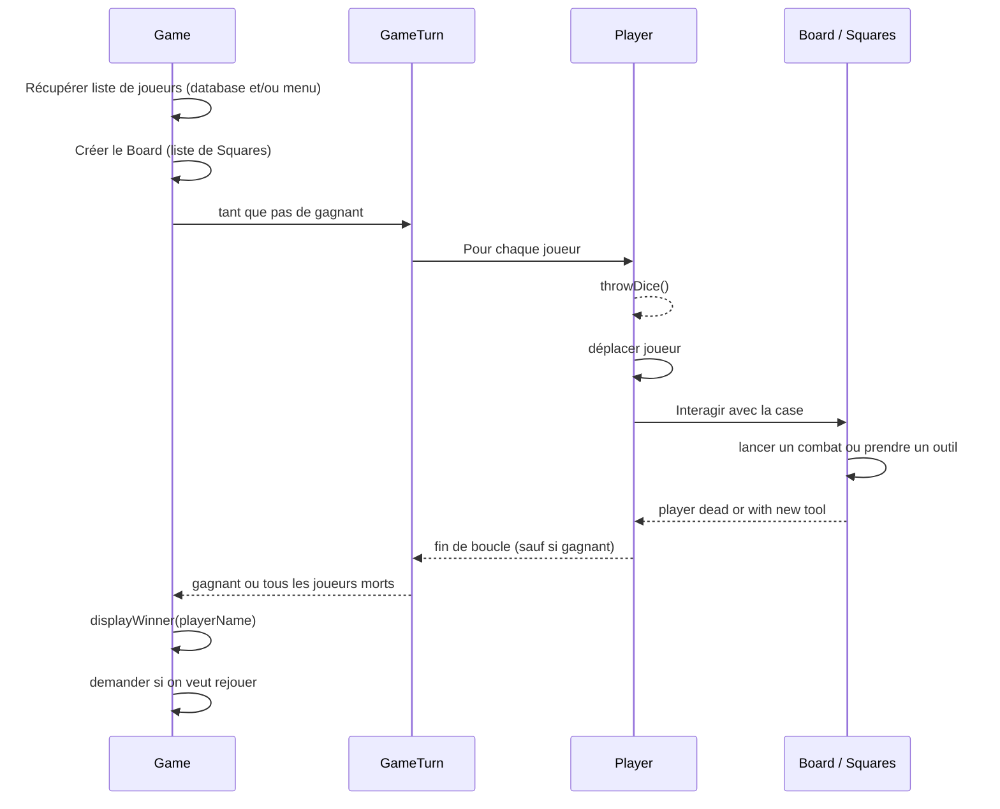

```mermaid
sequenceDiagram
    participant Game
    participant GameTurn
    participant Player
    participant Board / Squares
    Game ->> Game: Récupérer liste de joueurs (database et/ou menu)
    Game ->> Game: Créer le Board (liste de Squares)
    Game ->> GameTurn: tant que pas de gagnant
    GameTurn ->> Player: Pour chaque joueur
    Player -->> Player: throwDice()
    Player ->> Player: déplacer joueur
    Player ->> Board / Squares: Interagir avec la case
    Board / Squares ->> Board / Squares: lancer un combat ou prendre un outil
    Board / Squares -->> Player: player dead or with new tool
    Player -->> GameTurn: fin de boucle (sauf si gagnant)
    GameTurn -->> Game: gagnant ou tous les joueurs morts
    Game ->> Game: displayWinner(playerName)
    Game ->> Game: demander si on veut rejouer
```